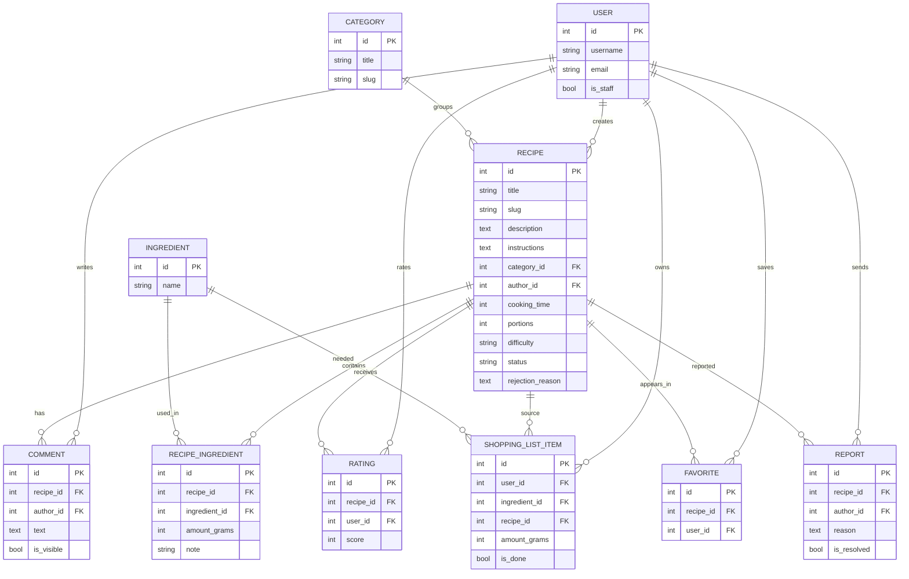

# Database Diagram

Crow's foot database diagram in Mermaid ERD format.

```mermaid
erDiagram
    USER ||--o{ RECIPE : creates
    USER ||--o{ COMMENT : writes
    USER ||--o{ RATING : rates
    USER ||--o{ FAVORITE : saves
    USER ||--o{ SHOPPING_LIST_ITEM : owns
    USER ||--o{ REPORT : sends

    CATEGORY ||--o{ RECIPE : groups
    RECIPE ||--o{ RECIPE_INGREDIENT : contains
    INGREDIENT ||--o{ RECIPE_INGREDIENT : used_in
    RECIPE ||--o{ COMMENT : has
    RECIPE ||--o{ RATING : receives
    RECIPE ||--o{ FAVORITE : appears_in
    RECIPE ||--o{ SHOPPING_LIST_ITEM : source
    INGREDIENT ||--o{ SHOPPING_LIST_ITEM : needed
    RECIPE ||--o{ REPORT : reported

    USER {
        int id PK
        string username
        string email
        bool is_staff
    }

    CATEGORY {
        int id PK
        string title
        string slug
    }

    INGREDIENT {
        int id PK
        string name
    }

    RECIPE {
        int id PK
        string title
        string slug
        text description
        text instructions
        int category_id FK
        int author_id FK
        int cooking_time
        int portions
        string difficulty
        string status
        text rejection_reason
    }

    RECIPE_INGREDIENT {
        int id PK
        int recipe_id FK
        int ingredient_id FK
        int amount_grams
        string note
    }

    COMMENT {
        int id PK
        int recipe_id FK
        int author_id FK
        text text
        bool is_visible
    }

    RATING {
        int id PK
        int recipe_id FK
        int user_id FK
        int score
    }

    FAVORITE {
        int id PK
        int recipe_id FK
        int user_id FK
    }

    SHOPPING_LIST_ITEM {
        int id PK
        int user_id FK
        int ingredient_id FK
        int recipe_id FK
        int amount_grams
        bool is_done
    }

    REPORT {
        int id PK
        int recipe_id FK
        int author_id FK
        text reason
        bool is_resolved
    }
```
